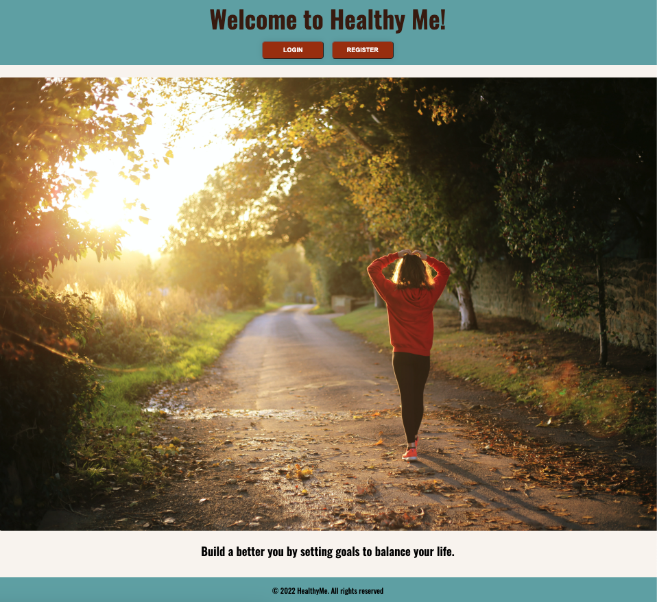

# Total Health and Wellness App

* Purpose of the App: The purpose of the app is to track your Physical Health, Mental Health, and Long Term Goals. By creating lists that a user can reference at any time, one will be able to become more accountable when setting out to complete a task, no matter how big or small.

* Features on the App: After creating a unique user profile, one will have the option to record their goals based on 3 different categories.  Once creating a specific goal the user can then add notes to that goal to help track progress and store their thoughts.  Goals as well as notes can be added or deleted at any point dependent on the users intended purpose of the app.

## Preview Example

## Link to Website
* [Healthy Me!](https://fierce-wave-69800.herokuapp.com/)

## Programming Languages
* CSS, Mustache, JavaScript, Node.js, Express.js, Sequelize

## Team Members
* [@ElyasO03](https://github.com/ElyasO03)
* [@NovaMerida](https://github.com/NovaMerida)
* [@MattHerringshaw1](https://github.com/MattHerringshaw1)
* [@ezaboroskie](https://github.com/ezaboroskie)
